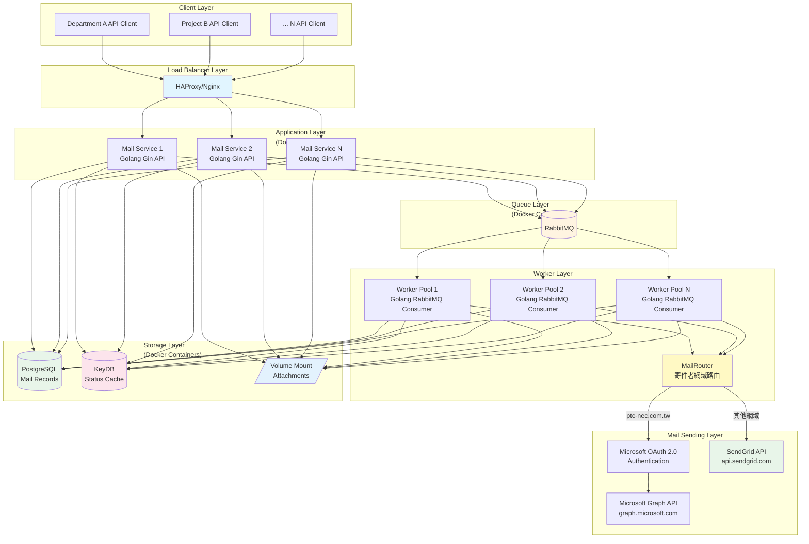
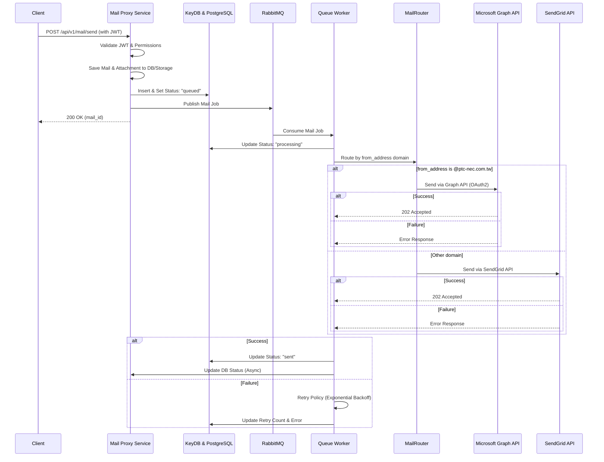

# [Mail Proxy] API 說明文件

本文件提供 `mail-proxy` 的 API 使用說明，包含認證方式、各端點規格、請求與回應範例，以及系統作業流程圖。

---

## 0. 架構圖 (Logic Layers)


---

## 1. 端點總覽
```
GET    /health                     # 健康探針

POST   /api/v1/mail/send           # 發送單封郵件
POST   /api/v1/mail/send/batch     # 批次發送郵件
GET    /api/v1/mail/status/:id     # 查詢郵件狀態
GET    /api/v1/mail/history        # 查詢郵件歷史
DELETE /api/v1/mail/cancel/:id     # 取消發送郵件

POST   /api/v1/auth/token          # 建立新 Token
GET    /api/v1/auth/token/:id      # 查詢 Token 資訊
DELETE /api/v1/auth/token/:id      # 撤銷 Token
GET    /api/v1/auth/tokens         # 列出所有 Token
```

### 1.1 健康探針 (Public Endpoints)
`GET /health`

用於系統健康狀態監控，**無需認證**。

**回應範例 (Healthy):**
```json
{
  "status": "healthy",
  "version": "1.0.0",
  "services": {
    "postgresql": "ok",
    "keydb": "ok",
    "rabbitmq": "ok"
  }
}
```

**回應範例 (Degraded - HTTP 503):**
```json
{
  "status": "degraded",
  "version": "1.0.0",
  "services": {
    "postgresql": "ok",
    "keydb": "error",
    "rabbitmq": "ok"
  }
}
```

---

## 2. 認證與授權 (Authentication & Authorization)

本系統使用 **JWT (JSON Web Token)** 進行 API 存取控制。

### 2.1 認證方式
所有需要認證的 API 必須在 HTTP Header 中攜帶 Bearer Token：
```http
Authorization: Bearer <Your_JWT_Token>
```

### 2.2 權限限制 (RBAC)
| 權限層級 | 可存取端點 | 說明 | 權限範圍 |
| :--- | :--- | :--- | :--- |
| **一般 Client** | `/api/v1/mail/*` | 郵件發送/取消、狀態查詢、歷史紀錄 | `mail:send`, `mail:read`, `mail:cancel` |
| **Admin** | `/api/v1/mail/*` + `/api/v1/auth/*` | 額外具備 Token 管理權限 | `admin` |
> ⚠️ **重要**: 即使 token 的 permissions 只有 admin，沒有 mail:send，一樣可以寄信！

### 2.3 錯誤回應
| HTTP Code | 錯誤代碼 | 說明 |
| :---: | :--- | :--- |
| 401 | `missing_token` | 未提供 Authorization Header |
| 401 | `invalid_token_format` | Token 格式錯誤，需使用 Bearer |
| 401 | `invalid_token` | Token 無效或已過期 |
| 401 | `token_revoked` | Token 已被撤銷 |
| 403 | `permission_denied` | 權限不足 |

---

## 3. 郵件相關 API (Mail API)

> **認證要求**: 需攜帶有效的 JWT Token

### 3.1 發送單封郵件
`POST /api/v1/mail/send`

發送單一電子郵件，**附件檔案上限 25 MB**。

**請求參數 (Request Body):**
| 欄位 | 類型 | 必填 | 說明 |
| :--- | :--- | :---: | :--- |
| `from` | string | ✓ | 發件人 Email |
| `to` | string[] | ✓ | 收件人 Email 列表 (至少一筆) |
| `cc` | string[] | | 副本收件人 |
| `bcc` | string[] | | 密件副本收件人 |
| `subject` | string | ✓ | 郵件主旨 |
| `body` | string | | 早期無障礙閱讀器，純文字內容 |
| `html` | string | | 現代郵件客戶端，HTML 渲染 |
| `attachments` | object[] | | 附件列表 |
| └ `filename` | string | ✓ | 檔案名稱 |
| └ `content` | string | ✓ | 檔案內容 (Base64 編碼) |
| └ `content_type`| string | | MIME 類型 (如 `application/pdf`) |
| `metadata` | object | | 自定義擴充資訊 |

> ⚠️ **重要**: body、html 同時提供兩者是最佳做法，確保所有收件人都能正確閱讀郵件

**請求範例:**
```json
{
  "from": "sender@example.com",
  "to": ["receiver@example.com"],
  "cc": ["cc@example.com"],
  "subject": "測試郵件",
  "html": "<h1>您好</h1><p>這是一封測試郵件。</p>",
  "attachments": [
    {
      "filename": "hello.txt",
      "content": "SGVsbG8gV29ybGQ=",
      "content_type": "text/plain"
    }
  ],
  "metadata": {
    "user_id": "xxx"
  }
}
```

**回應範例 (Success - 200):**
```json
{
  "success": true,
  "mail_id": "550e8400-e29b-41d4-a716-446655440000",
  "status": "queued",
  "message": "郵件已加入發送隊列"
}
```

**錯誤回應範例 (400):**
```json
{
  "success": false,
  "error": "attachment_too_large",
  "message": "report.pdf exceeds maximum size of 25MB"
}
```

---

### 3.2 批次發送郵件
`POST /api/v1/mail/send/batch`

一次發送多封電子郵件。

**請求範例:**
```json
{
  "mails": [
    {
      "from": "sender@example.com",
      "to": ["user1@example.com"],
      "subject": "通知 #1",
      "body": "這是第一封郵件"
    },
    {
      "from": "sender@example.com",
      "to": ["user2@example.com"],
      "subject": "通知 #2",
      "body": "這是第二封郵件"
    }
  ]
}
```

**回應範例 (Success - 200):**
```json
{
  "success": true,
  "batch_id": "b8f3e1a0-1234-5678-abcd-ef1234567890",
  "results": [
    { "mail_id": "550e8400-...", "status": "queued" },
    { "mail_id": "660f9500-...", "status": "queued" }
  ]
}
```

---

### 3.3 查詢郵件狀態
`GET /api/v1/mail/status/:id`

**路徑參數:**
| 參數 | 說明 |
| :--- | :--- |
| `id` | 郵件 UUID |

**可能的狀態值:**
| 狀態 | 說明 |
| :--- | :--- |
| `queued` | 已進入佇列，等待處理 |
| `processing` | Worker 正在處理中 |
| `sent` | 發送成功 |
| `failed` | 發送失敗 (已達重試上限) |
| `cancelled` | 已取消 |

**回應範例:**
```json
{
  "mail_id": "550e8400-e29b-41d4-a716-446655440000",
  "status": "sent",
  "retry_count": 0,
  "created_at": "2026-01-19T01:00:00Z",
  "sent_at": "2026-01-19T01:00:05Z",
  "error_message": ""
}
```

---

### 3.4 查詢郵件歷史
`GET /api/v1/mail/history`

查詢當前 Client 的郵件發送歷史紀錄。

**查詢參數:**
| 參數 | 類型 | 預設值 | 說明 |
| :--- | :--- | :---: | :--- |
| `page` | integer | 1 | 頁碼 |
| `limit` | integer | 20 | 每頁筆數 (最大 100) |
| `status` | string | | 過濾狀態 (可選) |

**請求範例:**
```
GET /api/v1/mail/history?page=1&limit=10&status=sent
```

**回應範例:**
```json
{
  "total": 150,
  "page": 1,
  "limit": 10,
  "data": [
    {
      "id": "550e8400-e29b-41d4-a716-446655440000",
      "from": "sender@example.com",
      "to": ["receiver@example.com"],
      "subject": "測試郵件",
      "status": "sent",
      "created_at": "2026-01-19T01:00:00Z",
      "sent_at": "2026-01-19T01:00:05Z"
    }
  ]
}
```

---

### 3.5 取消發送
`DELETE /api/v1/mail/cancel/:id`

取消一封 **尚在佇列中** 的郵件。

**限制條件:**
- 只有狀態為 `queued` 的郵件可以取消
- 正在處理中 (`processing`) 或已發送 (`sent`) 的郵件無法取消

**回應範例 (Success - 200):**
```json
{
  "success": true,
  "mail_id": "550e8400-e29b-41d4-a716-446655440000",
  "status": "cancelled",
  "message": "郵件已取消"
}
```

**錯誤回應範例 (400):**
```json
{
  "success": false,
  "error": "cannot_cancel",
  "message": "Only queued mails can be cancelled"
}
```

---

## 4. Token 管理 API (Admin Only)

> **認證要求**: 需攜帶具備 `admin` 權限的 JWT Token

### 4.1 建立 Client Token
`POST /api/v1/auth/token`

為新的 Client 系統建立 API Token。

**請求參數:**
| 欄位 | 類型 | 必填 | 說明 |
| :--- | :--- | :---: | :--- |
| `client_name` | string | ✓ | Client 名稱 |
| `department` | string | | 部門名稱 |
| `permissions` | string[] | ✓ | 權限列表 (如 `["mail.send", "mail.read", "mail.cancel"]`) |

**請求範例:**
```json
{
  "client_name": "行銷部門系統",
  "department": "Marketing",
  "permissions": ["mail.send","mail.read","mail.cancel"]
}
```

**回應範例 (Success - 201):**
```json
{
  "token": "eyJhbGciOiJIUzI1NiIsInR5cCI6IkpXVCJ9...",
  "client_id": "client_abc12345",
  "created_at": "2026-01-19T09:00:00Z"
}
```

> ⚠️ **重要**: Token 只會在建立時顯示一次，請妥善保存。

---

### 4.2 查詢 Token 資訊
`GET /api/v1/auth/token/:id`

**路徑參數:**
| 參數 | 說明 |
| :--- | :--- |
| `id` | Token UUID 或 `client_id` |

**回應範例:**
```json
{
  "id": "a1b2c3d4-1234-5678-abcd-ef1234567890",
  "client_id": "client_abc12345",
  "client_name": "行銷部門系統",
  "department": "Marketing",
  "permissions": ["mail.send"],
  "is_active": true,
  "created_at": "2026-01-19T09:00:00Z",
  "revoked_at": null
}
```

---

### 4.3 撤銷 Token
`DELETE /api/v1/auth/token/:id`

撤銷指定的 Client Token，使其立即失效。

**回應範例 (Success - 200):**
```json
{
  "success": true,
  "message": "Token 已撤銷"
}
```

---

### 4.4 列出所有 Token
`GET /api/v1/auth/tokens`

列出系統中所有已建立的 Client Token。

**回應範例:**
```json
{
  "total": 5,
  "data": [
    {
      "id": "a1b2c3d4-1234-5678-abcd-ef1234567890",
      "client_id": "client_abc12345",
      "client_name": "行銷部門系統",
      "department": "Marketing",
      "permissions": ["mail.send"],
      "is_active": true,
      "created_at": "2026-01-19T09:00:00Z"
    },
    {
      "id": "b2c3d4e5-2345-6789-bcde-fg2345678901",
      "client_id": "client_xyz98765",
      "client_name": "HR 系統",
      "department": "Human Resources",
      "permissions": ["mail.send"],
      "is_active": false,
      "created_at": "2026-01-15T10:00:00Z",
      "revoked_at": "2026-01-18T14:30:00Z"
    }
  ]
}
```

---

## 5. 系統流程圖 (Sequence Diagram)


