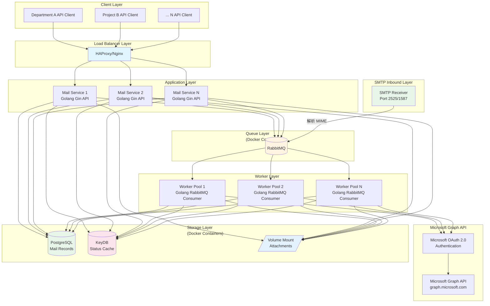

# Mail Proxy - 企業級分散式郵件發送系統

企業級分散式郵件發送系統，使用 Golang + Gin 開發，支援 Microsoft Graph API 與 SendGrid 雙路由發送郵件。

## 功能特點

- 🚀 **高效能**: 羽量級 Golang Goroutine 併發實踐 Queue Worker
- 🔐 **Microsoft OAuth 2.0**: 透過 Graph API 安全發送郵件
- 📧 **雙郵件路由**: 根據寄件者網域自動選擇 Graph API 或 SendGrid
- 🔄 **自動重試**: 指數退避演算法，寄信失敗最多 5 次重試
- 📊 **狀態追蹤**: KeyDB 快取郵件狀態，14 天 TTL
- 🐳 **容器化部署**: Docker Compose 一鍵啟動
- 📥 **SMTP Inbound**: 支援 SMTP 協定接收郵件並轉發 (Port 2525/1587)

## 系統架構



> 📖 詳細規格請參考 [SPEC.md](.doc/SPEC.md)

---

## 快速開始

### 正式環境部署 (Production)

連接 MIS 自建的 PostgreSQL、KeyDB、RabbitMQ：

```bash
cd .docker

# 1. 複製環境變數範本
cp .env.prod.example .env.prod

# 2. 編輯 .env.prod 填入 MIS 提供的連線資訊
#    - DATABASE_URL: PostgreSQL 連線字串
#    - RABBITMQ_URL: RabbitMQ 連線字串
#    - KEYDB_URL: KeyDB/Redis 連線位址
#    - MICROSOFT_*: Microsoft OAuth 2.0 憑證
#    - SENDGRID_API_KEY: SendGrid API Key (非組織網域寄件用)
#    - ORG_EMAIL_DOMAIN: 組織網域 (預設: @ptc-nec.com.tw)
#    - JWT_SECRET: API Token 簽名密鑰

# 3. 確保外部網路已存在（若 MIS 尚未建立）
docker network create infra-network

# 4. 啟動服務
docker compose -f docker-compose.prod.yml --env-file .env.prod up -d --build

# 5. 取得 MIS Admin Token
#    服務首次啟動時會自動建立一組 admin 權限的 Token
#    透過以下指令查看 Token：
docker logs mail-proxy-api 2>&1 | grep -A 20 "MIS ADMIN TOKEN"

# 6. 停止服務
docker compose -f docker-compose.prod.yml --env-file .env.prod down
```

> [!CAUTION]
> **MIS Admin Token 安全注意事項**
> - Token **只在首次建立時輸出到 logs**，之後無法再取得明文 Token
> - 建議 MIS 立即記錄此 Token 後，使用 `docker logs mail-proxy-api --until 5m` 清除或輪替 logs
> - **若有偵聽並紀錄 Docker logs 的容器**，請確保在 `container_name: mail-proxy-api` 啟動後才建立與偵聽，避免 Token 被記錄到其他系統

---

### 開發測試環境 (Development)

本地建立完整環境（包含 PostgreSQL、KeyDB、RabbitMQ）：

```bash
cd .docker

# 1. 複製環境變數範本
cp .env.dev.example .env.dev

# 2. 編輯 .env.dev 設定 Microsoft OAuth 2.0 憑證
MICROSOFT_TENANT_ID=
MICROSOFT_CLIENT_ID=
MICROSOFT_CLIENT_SECRET=

# 3. 啟動服務（包含本地資料庫、快取、訊息佇列）
docker compose -f docker-compose.dev.yml --env-file .env.dev up -d --build

# 4. 取得 MIS Admin Token（開發環境）
docker logs mail-proxy-api 2>&1 | grep -A 20 "MIS ADMIN TOKEN"

# 5. 停止服務
docker compose -f docker-compose.dev.yml --env-file .env.dev down
```

---

### 檢查服務狀態

```bash
# 健康檢查
curl http://localhost:8080/health

# 查看日誌
docker logs -f mail-proxy-api
docker logs -f mail-proxy-worker
docker logs -f mail-proxy-smtp-receiver
```

---

### SMTP Inbound Server

SMTP Inbound Server 允許舊系統或其他應用程式透過標準 SMTP 協定發送郵件：

```bash
# 使用 telnet 測試
telnet localhost 2525

# 簡易使用 swaks 測試 (Linux/macOS)
swaks --to recipient@example.com \
      --from sender@ptc-nec.com.tw \
      --server localhost:2525 \
      --body "這是測試郵件內容" \
      --header "Subject: SMTP 測試郵件"
      
# 完整使用 swaks 測試
# swaks 完整參數範例
swaks \
  # === 基本連接設定 ===
  --server localhost:2525 \
  --protocol SMTP \
  --timeout 60 \
  
  # === 郵件地址 ===
  --from "sender@ptc-nec.com.tw" \
  --to "recipient1@example.com,recipient2@example.com" \
  --cc "cc@example.com" \
  --bcc "bcc@example.com" \
  
  # === 信封地址 (可與郵件地址不同) ===
  --mail-from "envelope-sender@ptc-nec.com.tw" \
  --rcpt-to "envelope-recipient@example.com" \
  
  # === 郵件標頭 ===
  --header "Subject: SMTP 完整功能測試郵件" \
  --header "X-Custom-Header: TestValue123" \
  --header "X-Priority: 1" \
  --header "X-Mailer: swaks-testing" \
  --add-header "Reply-To: noreply@ptc-nec.com.tw" \
  
  # === 郵件內容 ===
  --body "這是測試郵件的純文字內容。\n\n包含多行文字。" \
  --data "custom_message.eml" \  # 或使用外部檔案
  
  # === 附件 ===
  --attach /path/to/attachment1.pdf \
  --attach-type "application/pdf" \
  --attach-name "測試文件.pdf" \
  
  # === 認證設定 ===
  --auth PLAIN \
  --auth-user "smtp_username" \
  --auth-password "smtp_password" \
  # --auth LOGIN \  # 其他認證方式
  # --auth CRAM-MD5 \
  # --auth DIGEST-MD5 \
  
  # === TLS/SSL 設定 ===
  --tls \
  --tls-on-connect \  # 使用 SMTPS (465)
  # --tls-cert /path/to/client-cert.pem \
  # --tls-key /path/to/client-key.pem \
  # --tls-ca /path/to/ca-cert.pem \
  --tls-verify \  # 驗證伺服器憑證
  
  # === SMTP 對話控制 ===
  --helo "mail.ptc-nec.com.tw" \
  --ehlo "mail.ptc-nec.com.tw" \
  --quit-after RCPT \  # 在 RCPT 命令後退出 (測試階段)
  # --quit-after AUTH \
  # --quit-after DATA \
  
  # === 輸出與除錯 ===
  --show-body \
  --show-headers \
  --show-raw-text \
  --hide-all \  # 隱藏所有輸出 (與其他 show 互斥)
  --silent 2 \  # 靜默等級 (0-3)
  --support \  # 顯示伺服器支援的功能
  
  # === 傳輸選項 ===
  --pipeline \  # 使用 SMTP pipelining
  --force-getpwuid \
  --local-interface 192.168.1.100 \  # 指定本地介面
  --local-port 0 \  # 指定本地端口 (0=隨機)
  
  # === 測試與除錯 ===
  --dump \  # 轉儲郵件內容
  --dump-mail \  # 只轉儲郵件部分
  --dry-run \  # 不實際發送
  --test-email \  # 使用測試郵件地址
  --suppress-data \  # 不發送 DATA 命令
  
  # === 特殊功能 ===
  --header-X-Mailer "Custom Mailer v1.0" \
  --h-From "Display Name <sender@ptc-nec.com.tw>" \
  --h-To "Recipient Name <recipient@example.com>" \
  --h-Subject "郵件主題" \
  --data-on-stdin \  # 從 stdin 讀取郵件內容
  
  # === 效能測試 ===
  --n-times 5 \  # 發送次數
  --interval 2 \  # 每次發送間隔 (秒)
  
  # === 其他 ===
  --socket-timeout 60 \
  --copy-routing "admin@ptc-nec.com.tw" \  # 複製所有郵件到此地址
  --server-port 2525
```

**SMTP Inbound 環境變數**：

| 變數 | 說明 | 預設值 |
|:-----|:-----|:-------|
| `SMTP_INBOUND_PORT` | SMTP 監聽埠號 | `2525` |
| `SMTP_INBOUND_TLS_PORT` | TLS 監聽埠號 | `1587` |
| `SMTP_AUTH_REQUIRED` | 是否需要認證 | `false` |
| `SMTP_ALLOWED_DOMAINS` | 允許的寄件網域 | 空白 |
| `SMTP_MAX_MESSAGE_SIZE_MB` | 最大郵件大小 | `25` MB |

---

## 文件

| 文件 | 說明 |
|:-----|:-----|
| [API 參考文件](.doc/API_REFERENCE.md) | API 端點、認證方式、請求/回應格式 |
| [系統規格書](.doc/SPEC.md) | 詳細系統設計、資料模型、流程圖 |
| [Postman Collection](.doc/Mail-Proxy.postman_collection.json) | API 文件與範例 |
| [Postman Tests](.doc/Mail-Proxy-Tests.postman_collection.json) | API 自動化測試套件 |

---

## API 測試

### 使用 Postman 執行測試

**匯入測試套件**：

```bash
# 將以下檔案匯入 Postman
.doc/Mail-Proxy-Tests.postman_collection.json
```

**設定環境變數**：

| 變數 | 說明 | 範例值 |
|:-----|:-----|:-----|
| `base_url` | API 基底網址 | `http://localhost:8080` |
| `admin_token` | MIS Admin Token | `eyJhbGciOiJIUzI1NiIs...` |
| `sla_threshold_ms` | SLA 閾值 (毫秒) | `2000` |

**執行測試**：

```
Postman → Collection → Mail Proxy API Tests → Run Collection
```

### 測試涵蓋範圍

| 測試類別 | 驗證項目 |
|:-----|:-----|
| **Contract Testing** | JSON Schema 驗證、Required 欄位、資料型別 |
| **Status Codes** | 200, 201, 400, 401, 403, 404 |
| **Business Logic** | UUID 格式、Enum 狀態值、分頁邏輯 |
| **Performance** | SLA < 2000ms |
| **Security** | 認證授權、SQL Injection 防護 |

---

## 專案結構

```
mail-proxy/
├── .docker/                                # Docker 配置
│   ├── api/                                # API Dockerfile
│   ├── worker/                             # Worker Dockerfile
│   ├── smtp-receiver/                      # SMTP Receiver Dockerfile
│   ├── .env.prod.example                   # 生產環境環境變數範本
│   ├── .env.dev.example                    # 開發環境環境變數範本
│   ├── docker-compose.prod.yml             # 生產環境 (連接外部基礎設施)
│   └── docker-compose.dev.yml              # 開發環境 (本地基礎設施)
├── .doc/                                   # 文件
│   ├── API_REFERENCE.md                    # API 參考文件
│   ├── Mail-Proxy.postman_collection.json  # Postman Collection
│   └── SPEC.md                             # 系統規格書
├── cmd/
│   ├── api/main.go                         # API 入口
│   ├── worker/main.go                      # Worker 入口
│   └── smtp-receiver/main.go               # SMTP Receiver 入口
├── internal/
│   ├── api/                                # API 層 (routes, handlers, middlewares)
│   ├── config/                             # 設定管理
│   ├── models/                             # 資料模型
│   ├── services/                           # 服務層
│   ├── smtp/                               # SMTP Inbound Server
│   └── worker/                             # Worker 消費者
├── pkg/microsoft/                          # Microsoft OAuth & Graph API
├── migrations/                             # 資料庫遷移腳本
└── go.mod                                  # Go 模組管理
```

---

## 本地開發 (無 Docker)

```bash
# 安裝依賴
go mod tidy

# 啟動 API
go run cmd/api/main.go

# 啟動 Worker
go run cmd/worker/main.go

# 啟動 SMTP Receiver
go run cmd/smtp-receiver/main.go
```

---

## 維護作業

### 定期清理附件 (Cronjob)

郵件附件儲存於 `ATTACHMENT_VOLUME_PATH` 目錄，建議設定 Cronjob 定期清理超過 60 天的舊資料。

**目錄結構**：

```
${ATTACHMENT_VOLUME_PATH}/
├── 2026/
│   ├── 01/
│   │   ├── 20/
│   │   │   ├── {mail_id}/
│   │   │   │   ├── document.pdf
│   │   │   │   └── image.png
```

**1. 建立清理腳本** (Ubuntu 22.04)

```bash
sudo nano /opt/scripts/cleanup-mail-attachments.sh
```

```bash
#!/bin/bash
# Mail Proxy 附件清理腳本
# 刪除超過 60 天的附件資料夾

ATTACHMENT_PATH="${ATTACHMENT_VOLUME_PATH:-/mnt/shared-storage/mail-proxy-attachments}"
RETENTION_DAYS=60
LOG_FILE="/var/log/mail-proxy-cleanup.log"

echo "[$(date '+%Y-%m-%d %H:%M:%S')] Starting attachment cleanup..." >> "$LOG_FILE"

# 找出並刪除超過 60 天的 mail_id 資料夾
find "$ATTACHMENT_PATH" -mindepth 4 -maxdepth 4 -type d -mtime +$RETENTION_DAYS -exec rm -rf {} \; 2>/dev/null

# 清理空的日期資料夾 (day -> month -> year)
find "$ATTACHMENT_PATH" -mindepth 3 -maxdepth 3 -type d -empty -delete 2>/dev/null
find "$ATTACHMENT_PATH" -mindepth 2 -maxdepth 2 -type d -empty -delete 2>/dev/null
find "$ATTACHMENT_PATH" -mindepth 1 -maxdepth 1 -type d -empty -delete 2>/dev/null

echo "[$(date '+%Y-%m-%d %H:%M:%S')] Cleanup completed." >> "$LOG_FILE"
```

```bash
# 設定執行權限
sudo chmod +x /opt/scripts/cleanup-mail-attachments.sh
```

**2. 設定 Cronjob** (每天凌晨 01:00 執行)

```bash
sudo crontab -e
```

新增以下排程：

```cron
# Mail Proxy 附件清理 - 每天凌晨 1 點執行
0 1 * * * ATTACHMENT_VOLUME_PATH=/mnt/shared-storage/mail-proxy-attachments /opt/scripts/cleanup-mail-attachments.sh
```

**3. 驗證設定**

```bash
# 查看目前 Cronjob
sudo crontab -l

# 手動測試腳本
sudo ATTACHMENT_VOLUME_PATH=/mnt/shared-storage/mail-proxy-attachments /opt/scripts/cleanup-mail-attachments.sh

# 查看執行日誌
tail -f /var/log/mail-proxy-cleanup.log
```

> [!TIP]
> 若需調整保留天數，修改腳本中的 `RETENTION_DAYS=60` 即可。

